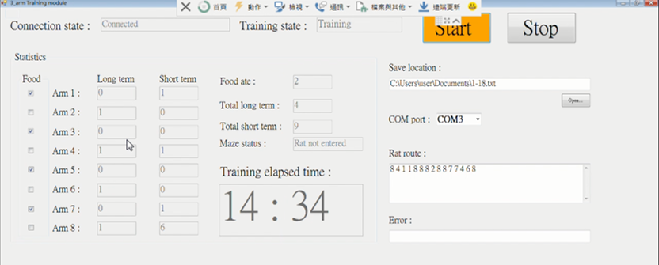
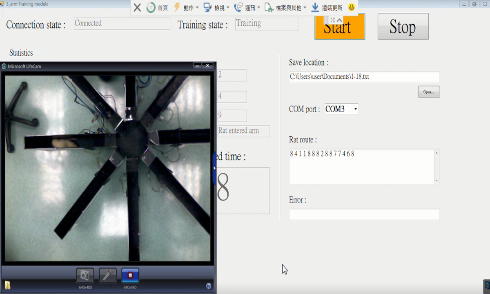
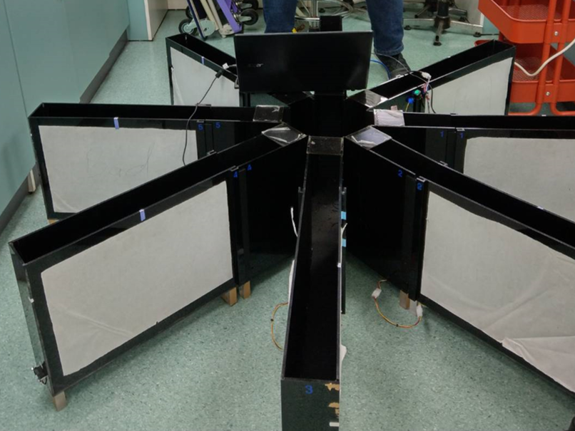

# A 8-arm maze training platform for lab rat
## Introduction
This training platform is used to evaluate the recovery of the lab rat which has suffered Alzheimer's disease.

## Evaluation Method
To evaluate the recovery of the lab rat, we give them 3 days to adapt the training platform, during the adaptation, we place food at the end of four of eight arms to let lab rat has memory that which arm has food, after adaptation, we put the lab rat inside the training platform again, this time we start the evaluation, once the lab rat get inside the no-food arm, we count it as one long term memory error(max counting four times), which indicate that the disease recovery is bad, and if the lab rat get in the same arm twice, we count it as short term error, which also indicate that the recovery is bad, and the trigger of end of training is that user clicked stop button or the lab rat entered all arms which has food. The method described above is designed by medical researcher.

## Implementation
We place an IR distance sensor at the end of each arm to detect the position of the lab rat, then we examine and update the training data(long term error...etc) once the lab rat entered the arm or left the arm, note that arm with food is selected by user at GUI and there is a timer inside GUI for counting total training time.

## Hardware Specification
- STM32F407 Discovery * 1
- Sharp 2Y0A21 IR distance sensor * 8
- Wifi module esp8266 * 1
## Screenshot & Picture
### UI ([UI project link](https://github.com/flawless0714/8_arm_Maze/tree/wired-transmit))

### Training

### Hardware
